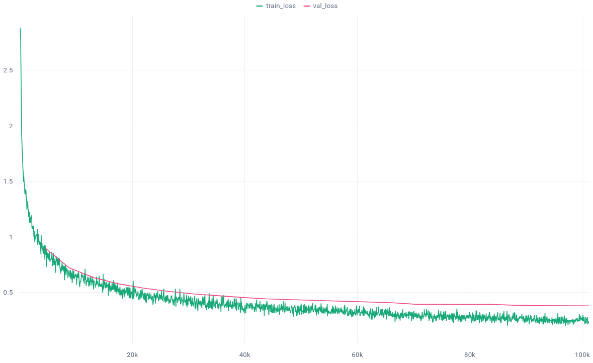
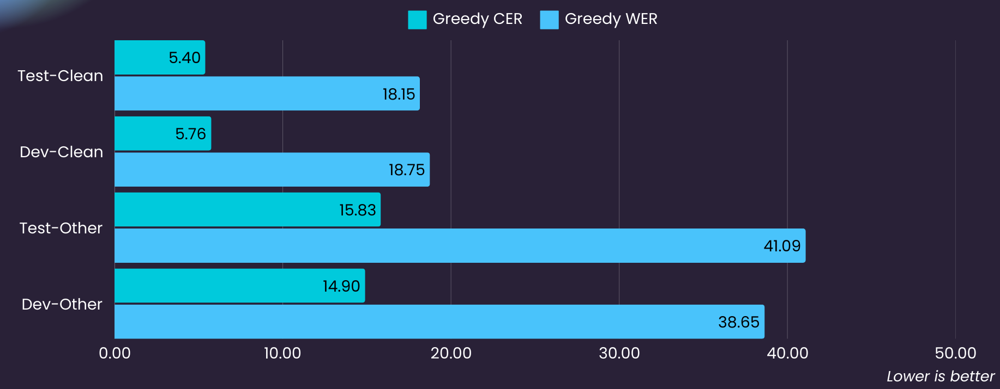
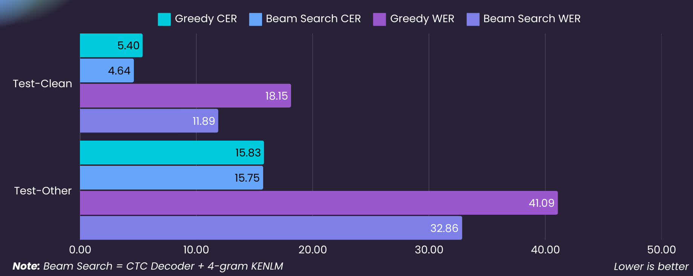
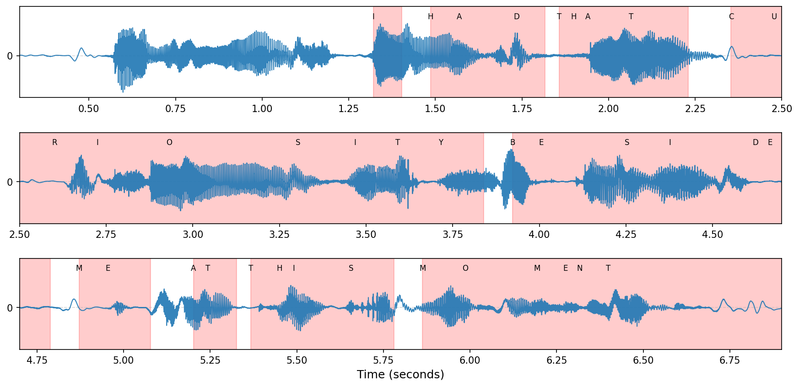

## Deep Speech 2

<div align="center">

      

</div>

This repository contains an implementation of the paper __Deep Speech 2: End-to-End Speech Recognition__, a state-of-the-art ASR model designed to transcribe speech into text with end-to-end training using deep learning techniques in 2015. using __Lightning AI :zap:__. 

## 📜 Paper & Blogs Review 

- [x] [Gated Recurrent Neural Networks](https://arxiv.org/pdf/1412.3555)
- [x] [Deep Speech 2: End-to-End Speech Recognition](https://arxiv.org/abs/1512.02595)
- [x] [KenLM](https://kheafield.com/code/kenlm/)
- [x] [Boosting Sequence Generation Performance with Beam Search Language Model Decoding](https://towardsdatascience.com/boosting-your-sequence-generation-performance-with-beam-search-language-model-decoding-74ee64de435a)

--- 

## Installation

1. Clone the repository:
   ```bash
   git clone https://github.com/LuluW8071/Deep-Speech-2.git
   cd neuralnet
   ```

2. Install **[Pytorch](https://pytorch.org/)** and  required dependencies:
   ```bash
   pip install -r requirements.txt
   ```

   Ensure you have `PyTorch` and `Lightning AI` installed.

## Usage

### Training

>[!IMPORTANT]
> Before training make sure you have placed __comet ml api key__ and __project name__ in the environment variable file `.env`.

To train the **Deep Speech 2** model, use the following command for default training configs:

```bash
python3 train.py
```

Customize the pytorch training parameters by passing arguments in `train.py` to suit your needs:

Refer to the provided table to change hyperparameters and train configurations.
| Args                  | Description                                                           | Default Value                 |
|-----------------------|-----------------------------------------------------------------------|-------------------------------|
| `-g`, `--gpus`       | Number of GPUs per node                                              | `1`                           |
| `-w`, `--num_workers` | Number of data loading workers (`0` means main process only)        | `4`                           |
| `-db`, `--dist_backend` | Distributed backend for multi-GPU training                        | `'ddp_find_unused_parameters_true'` |
| `-m`, `--model_type`  | Type of RNN model (`lstm` or `gru`)                                 | `'lstm'`                      |
| `-cl`, `--resnet_layers` | Number of residual CNN layers                                   | `2`                           |
| `-nl`, `--rnn_layers` | Number of RNN layers                                               | `3`                           |
| `-rd`, `--rnn_dim`    | RNN dimension                                                      | `512`                         |
| `--epochs`           | Total number of training epochs                                    | `50`                          |
| `--batch_size`       | Batch size                                                         | `32`                          |
| `-gc`, `--grad_clip` | Gradient clipping                                                 | `0.6`                         |
| `-lr`, `--learning_rate` | Learning rate                                                | `2e-4`                        |
| `--precision`        | Precision mode                                                    | `'16-mixed'`                  |
| `--checkpoint_path`  | Path to a checkpoint file for resuming training                   | `None`                        |


## Experiment Results

The model was trained on __LibriSpeech train set__ (100 + 360 + 500 hours) and validated on the __LibriSpeech test set__ ( ~ 10.5 hours) with __16-mixed__ precision. 

| Model Type | ResCNN Layers | RNN Layers | RNN Dim | Epochs | Batch Size | Grad Clip | LR |
|------------|---------------|------------|---------|--------|------------|-----------|----|
| BiLSTM     | 2             | 3          | 512     | 25     | 64         | 0.6       | 2e-4 |

#### Loss Curves


#### WER & CER Metrics


| Word Score | LM Weight | N-gram LM | Beam Size | Beam Threshold |
|------------|-----------|-----|------|----------------|
| -0.26       | 0.3       | 4-gram | 25        | 10             |



#### Alignments



## Citations

```bibtex
@misc{amodei2015deepspeech2endtoend,
      title={Deep Speech 2: End-to-End Speech Recognition in English and Mandarin}, 
      author={Dario Amodei and Rishita Anubhai and Eric Battenberg and Carl Case and others,
      year={2015},
      url={https://arxiv.org/abs/1512.02595}, 
}
```